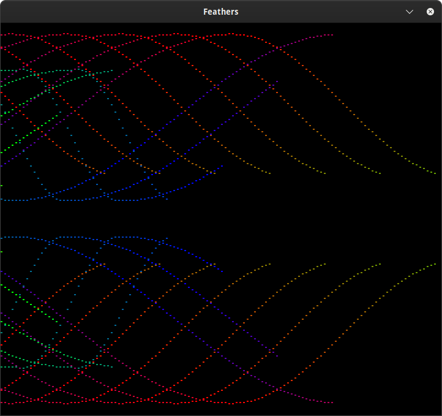
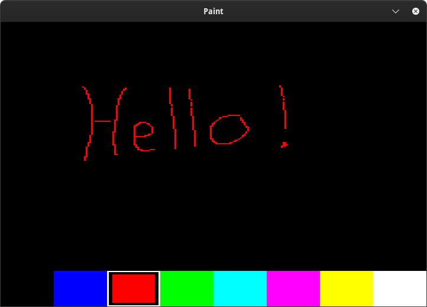

# SDL2 Display driver for the MicroPython Unix port.

## Introduction
This driver uses the SDL2 library to emulate a framebuf compatible graphic
display on the host computer. It supports independent scaling of the display in
the x and y axis.

## Installation

### Setup build environment for Ubuntu 20.04.5 LTS and 22.04 LTS
```bash
sudo apt-get update
sudo apt-get -y install build-essential libffi-dev git pkg-config cmake python3-pip python3-virtualenv libsdl2-dev
```

### Setup build environment for AlmaLinux 9
```bash
sudo dnf install -y git gcc gcc-c++ make cmake python3-pip libffi-devel SDL2-devel
```

### Clone micropython and micropython_sdl2 repositories
```bash
mkdir micropython_sdl2
cd micropython_sdl2

git clone https://www.github.com/micropython/micropython
git clone https://github.com/russhughes/micropython_sdl2.git
```

### Build micropython
```bash
cd micropython
make -C mpy-cross/
make -C ports/unix/ submodules
make -C ports/unix/ USER_C_MODULES=../../../micropython_sdl2/
```
The micropython executable will be in the ports/unix/build-standard/ directory. You can run it from there, or copy it to a more convenient location.

### Run micropython examples
```bash
 ./ports/unix/build-standard/micropython ../micropython_sdl2/examples/feathers.py
 ./ports/unix/build-standard/micropython ../micropython_sdl2/examples/paint.py
```

## Examples

### display.py

The display.py module contains the Display class that provides a simple
interface to the SDL2 display driver.

### feathers.py



Scrolls rainbow-colored mirrored random curves across the display.

### paint.py example



A very simple paint program to demonstrate the use of the mouse as an input
device.

## API REFERENCE

### SDL2

```python
sdl2.SDL2(
    width=320,
    height=240,
    x=SDL_WINDOWPOS_CENTERED,
    y=SDL_WINDOWPOS_CENTERED,
    title="MicroPython",
    window_flags=SDL_WINDOW_SHOWN,
    render_flags=SDL_RENDERER_ACCELERATED | SDL_RENDERER_PRESENTVSYNC)
```

#### Description
Creates a window and renderer with the specified position, dimensions,
title, flags and returns a SDL2 object.

#### Parameters
- `width` The width of the window. Default: 320
- `height` The height of the window. Default: 240
- `x` The x position of the window. Default: SDL_WINDOWPOS_CENTERED
   - SDL_WINDOWPOS_UNDEFINED - used to indicate that you don't care what the x position is
   - SDL_WINDOWPOS_CENTERED - used to indicate that the window position should be centered

- `y` The y position of the window. Default: SDL_WINDOWPOS_CENTERED
   - SDL_WINDOWPOS_UNDEFINED - used to indicate that you don't care what the y position is
   - SDL_WINDOWPOS_CENTERED - used to indicate that the window position should be centered

- `x_scale` The x scale of the window. Default: 1
- `y_scale` The y scale of the window. Default: 1
- `title` The title of the window. Default: "MicroPython"
- `window_flags` The window flags. Default: SDL_WINDOW_SHOWN
   - SDL_WINDOW_SHOWN - the window is visible
   - SDL_WINDOW_BORDERLESS - no window decoration

- `render_flags` The render flags. Default: SDL_RENDERER_ACCELERATED | SDL_RENDERER_PRESENTVSYNC
   - SDL_RENDERER_ACCELERATED - the renderer uses hardware acceleration
   - SDL_RENDERER_PRESENTVSYNC - present is synchronized with the refresh rate

#### Returns
- A new SDL2 object.

#### Raises
- RuntimeError for any SDL2 errors.


### show

```python
SDL2.show(buffer)
```
#### Description

Show the buffer on the SDL2 window.

#### Parameters

- `buffer` bytearray of 16-bit RGB565 values

#### Raises

- ValueError if the buffer is the wrong size.
- RuntimeError for any SDL2 errors.

### event

```python
SDL2.event()
```

#### Description

Checks for events and returns a tuple describing the event if there is one,
otherwise returns None.

#### Returns:

- None or a tuple describing the event

#### Event Types:

  - SDL_KEYDOWN or SDL_KEYUP

    (event_type, keyname, mod)

    Index       | Item       | Description
    ------------|------------|------------
    sdl.EVENT   | event_type | SDL_KEYDOWN or SDL_KEYUP
    sdl.KEYNAME | keyname    | name of the key pressed or released if any
    sdl.MOD     | mod        | status of modifier keys (shift, ctrl, alt, etc.)

  - SDL_MOUSEMOTION

    (event_type, x, y, xrel, yrel, state)

     Index       | Item       | Description
    -------------|------------|------------
     sdl.EVENT   | event_type | SDL_MOUSEMOTION
     sdl.X       | x          | coordinates of the mouse
     sdl.Y       | y          | coordinates of the mouse
     sdl.XREL    | xrel       | relative motion in the X direction
     sdl.YREL    | yrel       | relative motion in the Y direction
     sdl.STATE   | state      | state of the mouse buttons

  - SDL_MOUSEBUTTONDOWN or SDL_MOUSEBUTTONUP

    (event_type, x, y, button)

     Index       | Item       | Description
    -------------|------------|------------
     sdl.EVENT   | event_type | SDL_MOUSEBUTTONDOWN or SDL_MOUSEBUTTONUP
     sdl.X       | x          | coordinates of the mouse
     sdl.Y       | y          | coordinates of the mouse
     sdl.BUTTON  | button     | button pressed or released

    button constants

     Constant         | Description
    ------------------|------------
    SDL_BUTTON_LEFT   | Left button was pressed or released
    SDL_BUTTON_MIDDLE | Middle button was pressed or released
    SDL_BUTTON_RIGHT  | Right button waa pressed or released

  - SDL_MOUSEWHEEL

    (event_type, x, y, direction, preciseX, preciseY, mouseX, mouseY)

     Index         | Item       | Description
    ---------------|------------|------------
     sdl.EVENT     | event_type | SDL_MOUSEWHEEL
     sdl.X         | x          | amount scrolled horizontally
     sdl.Y         | y          | amount scrolled vertically
     sdl.DIRECTION | direction  | direction of the scroll
     sdl.PRECISEX  | preciseX   | amount scrolled horizontally, positive to the right and negative to the left, with float precision
     sdl.PRECISEY  | preciseY   | amount scrolled vertically, positive away from the user and negative toward the user, with float precision
     sdl.MOUSEX    | mouseX     | X coordinate, relative to window
     sdl.MOUSEY    | mouseY     | Y coordinate, relative to window

  - SDL_QUIT

     Index         | Item       | Description
    ---------------|------------|------------
     sdl.EVENT     | event_type | SDL_QUIT


  - all others return a tuple containing the integer (event_type) id of the event

     Index         | Item       | Description
    ---------------|------------|------------
     sdl.EVENT     | event_type | integer event_type id


### deinit()

```python
SDL2.deinit()
```
#### Description

Deinitialize SDL2, removes all SDL2 windows.

### SDL2 constants
  See the SDL2 API doucmentation for more information on these constants.

- SDL_WINDOWPOS_UNDEFINED
- SDL_WINDOWPOS_CENTERED
- SDL_WINDOW_SHOWN
- SDL_WINDOW_BORDERLESS

- SDL_RENDERER_ACCELERATED
- SDL_RENDERER_PRESENTVSYNC

- SDL_MOUSEMOTION

  event tuple index constants:
   - X
   - Y
   - XREL
   - YREL
   - STATE

- SDL_MOUSEBUTTONDOWN
- SDL_MOUSEBUTTONUP

  event tuple index constants:
   - X
   - Y
   - BUTTON

- SDL_MOUSEWHEEL
- SDL_MOUSEWHEEL_NORMAL
- SDL_MOUSEWHEEL_FLIPPED

  event tuple index constants:
   - X
   - Y
   - DIRECTION
   - PRECISEX
   - PRECISEY
   - MOUSEX
   - MOUSEY

- SDL_KEYDOWN
- SDL_KEYUP

  event tuple index constants:
   - TYPE
   - KEYNAME
   - MOD

- KMOD_NONE
- KMOD_LSHIFT
- KMOD_RSHIFT
- KMOD_LCTRL
- KMOD_RCTRL
- KMOD_LALT
- KMOD_RALT
- KMOD_LGUI
- KMOD_RGUI
- KMOD_NUM
- KMOD_CAPS
- KMOD_MODE
- KMOD_SCROLL
- KMOD_CTRL
- KMOD_LCTRL
- KMOD_RCTRL
- KMOD_SHIFT
- KMOD_LSHIFT
- KMOD_RSHIFT
- KMOD_ALT
- KMOD_LALT
- KMOD_RALT
- KMOD_GUI

- SDL_QUIT
